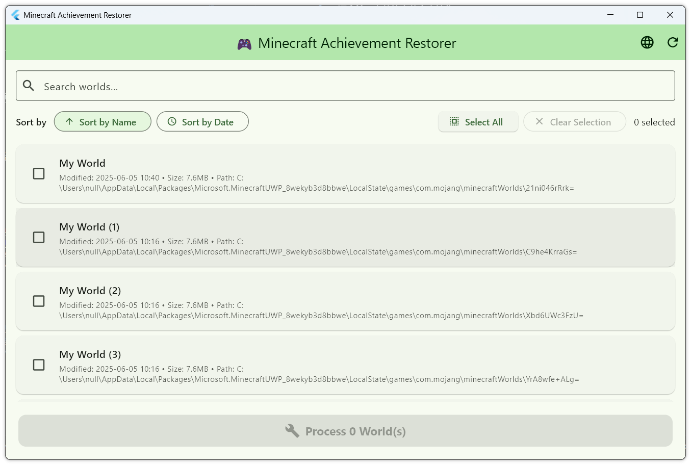

# Minecraft Achievement Restorer

A Flutter desktop application for restoring achievements in Minecraft Bedrock Edition worlds.

English | [中文说明](README_CN.md)

## Features

- 🔍 **Auto-scan worlds** - Automatically detects Minecraft Bedrock Edition worlds on your system
- 🎯 **Batch processing** - Select and process multiple worlds at once
- 🔄 **Achievement restoration** - Restores achievements by modifying level.dat files
- 💾 **Automatic backup** - Creates backup files before making any changes
- 🌐 **Bilingual support** - Full Chinese and English localization
- 📊 **Sorting support** - Sort worlds by name or last modified date
- 🔍 **Search functionality** - Quickly find specific worlds

## Screenshots



## System Requirements

- Windows 10/11
- Minecraft Bedrock Edition (Windows 10 Edition)
- No additional dependencies required

## Installation

### Option 1: Download Release
1. Go to [Releases](https://github.com/yourusername/minecraft-achievement-restorer/releases)
2. Download the latest `minecraft-achievement-restorer-windows.zip`
3. Extract and run `minecraft_achievement_restorer.exe`

### Option 2: Build from Source
```bash
# Clone the repository
git clone https://github.com/yourusername/minecraft-achievement-restorer.git
cd minecraft-achievement-restorer

# Install dependencies
flutter pub get

# Generate localization files
flutter gen-l10n

# Build for Windows
flutter build windows --release
```

## Usage

1. **Launch the application**
   - Close Minecraft or exit to the main menu
   - Run the app, it will automatically scan for Minecraft worlds

2. **Select worlds to process**
   - Use checkboxes to select worlds
   - Use "Select All" or "Clear Selection" for batch operations
   - Use the search bar to find specific worlds

3. **Sort and organize**
   - Sort by world name (A-Z or Z-A)
   - Sort by last modified date (newest or oldest first)

4. **Process worlds**
   - Click "Process X World(s)" button
   - Confirm the operation in the dialog
   - Wait for processing to complete

5. **Re-enter the world**
   - Re-enter the world, even though the mode shows "Creative"

## How It Works

The application modifies the `level.dat` file in each selected world to restore achievement functionality. It:

1. Creates a backup of the original `level.dat` file
2. Modifies specific flags in the file to enable achievements
3. Saves the modified file back to the world directory

**Note**: Although the app creates automatic backups, please make sure to manually backup important worlds before processing.

## Supported Languages

- 🇺🇸 English
- 🇨🇳 Simplified Chinese

## Troubleshooting

### No worlds found
- Ensure Minecraft Bedrock Edition (Windows 10 Edition) is installed
- Try creating a new world in Minecraft first

### Processing failed
- Make sure Minecraft is completely closed
- Check that you have write permissions to the Minecraft directory
- Verify the world has a valid `level.dat` file

### Application won't start
- Ensure you have Windows 10/11

## Contributing

Contributions are welcome! Please feel free to submit a Pull Request.

## License

This project is licensed under the MIT License - see the [LICENSE](LICENSE) file for details.

## Disclaimer

This tool modifies Minecraft world files. While it creates backups, use at your own risk. Always backup your important worlds manually before using this tool.

---

Made with ❤️ using Flutter
