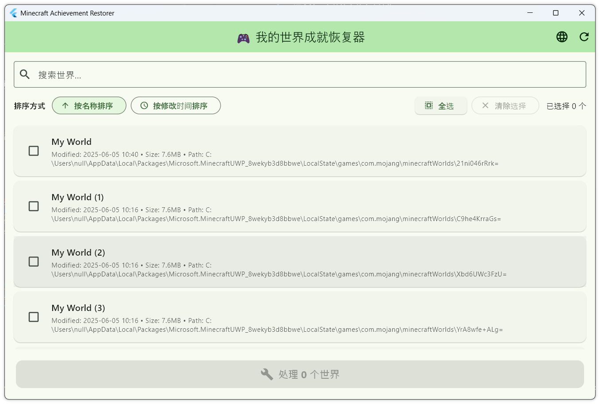

# Minecraft 成就恢复器

一个用于恢复 Minecraft 基岩版世界成就的 Flutter 桌面应用程序。

English | [中文说明](README_CN.md)

## 功能特性

- 🔍 **自动扫描世界** - 自动检测系统中的 Minecraft 基岩版世界
- 🎯 **批量处理** - 一次选择和处理多个世界
- 🔄 **成就恢复** - 通过修改 level.dat 文件恢复成就功能
- 💾 **自动备份** - 在进行任何更改前自动创建备份文件
- 🌐 **双语支持** - 完整的中英文本地化
- 📊 **排序支持** - 按名称或最后修改时间排序世界
- 🔍 **搜索功能** - 快速查找特定世界

## 截图



## 系统要求

- Windows 10/11
- Minecraft 基岩版（Windows 10 版本）
- 无需额外依赖

## 安装方法

### 方式一：下载发布版
1. 前往 [Releases](https://github.com/yourusername/minecraft-achievement-restorer/releases)
2. 下载最新的 `minecraft-achievement-restorer-windows.zip`
3. 解压并运行 `minecraft_achievement_restorer.exe`

### 方式二：从源码构建
```bash
# 克隆仓库
git clone https://github.com/yourusername/minecraft-achievement-restorer.git
cd minecraft-achievement-restorer

# 安装依赖
flutter pub get

# 生成本地化文件
flutter gen-l10n

# 构建 Windows 版本
flutter build windows --release
```

## 使用方法

1. **启动应用程序**
   - 关闭 Minecraft 或者关闭世界退回到主菜单
   - 运行应用，会自动扫描 Minecraft 世界

2. **选择要处理的世界**
   - 使用复选框选择世界
   - 使用"全选"或"清除选择"进行批量操作
   - 使用搜索栏查找特定世界

3. **排序和整理**
   - 按世界名称排序（A-Z 或 Z-A）
   - 按最后修改时间排序（最新或最旧优先）

4. **处理世界**
   - 点击"处理 X 个世界"按钮
   - 在对话框中确认操作
   - 等待处理完成

5. **重新进入世界**
   - 重新进入世界，尽管模式显示“创造”

## 工作原理

应用程序通过修改每个选定世界的 `level.dat` 文件来恢复成就功能。具体步骤：

1. 创建原始 `level.dat` 文件的备份
2. 修改文件中的特定标志以启用成就
3. 将修改后的文件保存回世界目录

**注意**：虽然应用会自动创建备份，但在处理前请务必手动备份重要世界。

## 支持语言

- 🇺🇸 English（英语）
- 🇨🇳 简体中文

## 故障排除

### 未找到世界
- 确保已安装 Minecraft 基岩版（Windows 10 版本）
- 尝试先在 Minecraft 中创建一个新世界

### 处理失败
- 确保 Minecraft 已完全关闭
- 检查是否有 Minecraft 目录的写入权限
- 验证世界是否有有效的 `level.dat` 文件

### 应用程序无法启动
- 确保使用 Windows 10/11

## 贡献

欢迎贡献！请随时提交 Pull Request。

## 许可证

本项目采用 MIT 许可证 - 详见 [LICENSE](LICENSE) 文件。

## 免责声明

此工具会修改 Minecraft 世界文件。虽然会创建备份，但使用风险自负。使用此工具前请务必手动备份重要世界。

---

使用 Flutter ❤️ 制作
